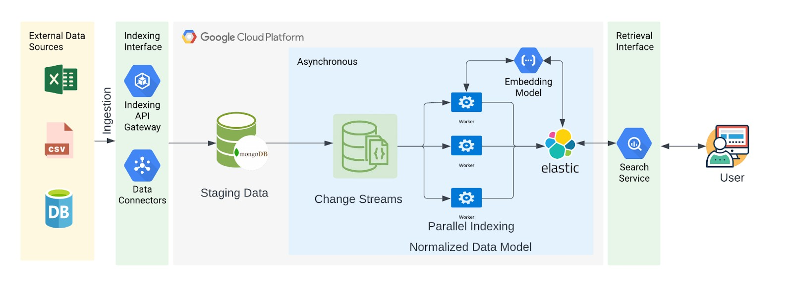

## Build for Bharat - Catalog indexing engine

This repo has code as submission for Build for Bharat - ONDC Hackathon

### Team Details:

- Nanda Teja Rajasekharuni
- Varun Kruthiventi
- Adiluddin Mohammed
- Ranjith Reddy

## Dataset used for problem

https://www.kaggle.com/datasets/surajjha101/bigbasket-entire-product-list-28k-datapoints

## High Level Architecture



#### Components

- Backend Service (UI, Data ingestion endpoint)
- Elasticsearch
- Kibana
- Kafka

### Video Presentation

https://bit.ly/indexvoyagers-ondc-hackathon-video

### Instructions for setup

- The repository uses Makefile for orchestrating the services.
- .env file has config parameters related to Elasticsearch, Kibana

## Starting the Docker Services


```bash
make start
```

Verify if the containers are up and running.

```bash
docker compose ps
```

- Elasticsearch can be accessed here: http://localhost:9200
- Kibana can be accessed here: http://localhost:5601
- Backend service: http://localhost:80
- Kafka can be accessed here: kafka:29092, http://localhost:9092
- Kafdrop (Kafka UI) can be accessed here: http://localhost:9000

Application UI can be accessed here: http://localhost:80
Swagger Docs can be accessed here: http://localhost:80/docs

### Initial Data Load

In the first step, the product catalog data will be ingested into the system without vectorization. It will be done using http://localhost:80/documents/index endpoint.

Note: This endpoint also supports vectorization as feature flag. If enabled in the payload, it can index the vector embeddings of the product details as well.

```bash
make initial_load
```

Once the script is executed successfully, the documents count can be verified here: http://localhost/document_count

### Async Data Load

In this step, we use a script to ingest data into the system using a Kafka Producer. This allows integration with external systems and CDC applications.

```bash
make load_async
```

- The speed of ingestion varies based on the ML model being used for vectorization of the product attributes.
- The ingestion also depends on the infrastructure being used for vectorization. In our application, we have used CPU based infrastructure for ease of demo. GPU based infra can accelerate the vector based ingestion speed.
- In this application, we are using ```l3cube-pune/indic-sentence-similarity-sbert model``` from [Huggingface](https://huggingface.co/l3cube-pune/indic-sentence-similarity-sbert).